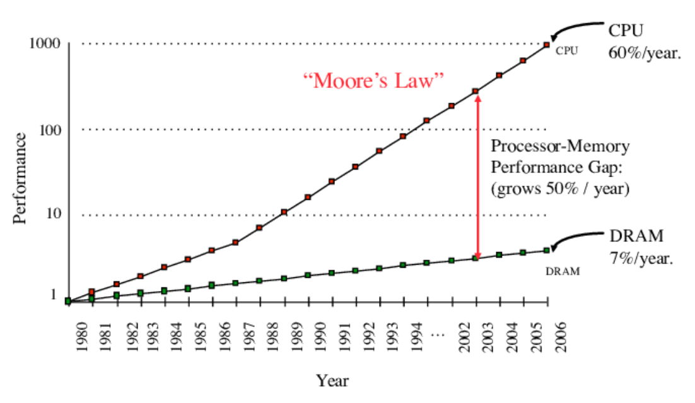

# Cache hierarchy - Các cấp bậc của bộ nhớ đệm

Các câu hỏi mà chúng mình sẽ target trong bài viết này là:

1. Lý do cần cache nhiều cấp \
1.1. Hiện tượng "Memory Gap" \
1.2. Sự đánh đổi giữa tốc độ, kích thước và chi phí của bộ nhớ \
1.3. Tính cục bộ của dữ liệu \
1.4. Cải thiện hiệu suất tổng thể \
1.5. Xu hướng hiện đại và nhu cầu của các hệ thống đa lõi \
2. Cấu trúc cache nhiều cấp \
2.1. L1 cache: nhỏ, nhanh \
2.2. L2 cache: lớn hơn, giảm miss rate \
2.3. L3 cache: trên hệ thống đa lõi \
3. Cache phân chia (banked) vs cache hợp nhất (unified) \
4. Phân tích hiệu suất cache nhiều cấp \
4.1. Miss rate local vs global \
4.2. Công thức AMAT cho cache nhiều cấp \

*Đây là phần chuẩn bị của mình trong bài viết về Cache mà nhóm chúng mình thực hiện, bài viết sẽ được upload sau khi hoàn thành và thuyết trình.*

### 1. Lý do cần cache nhiều cấp

Bộ nhớ đệm (cache) nhiều cấp là một giải pháp quan trọng trong kiến trúc máy tính nhằm tối ưu hóa hiệu suất truy cập bộ nhớ. Lý do chính dẫn đến việc cần có hệ thống cache nhiều cấp có thể phân tích từ nhiều góc độ: tốc độ truy cập, chi phí phần cứng, đặc điểm của bộ nhớ chính, và nhu cầu xử lý hiệu năng cao của bộ vi xử lý hiện đại.

1.1. Hiện tượng "Memory Gap" (Khoảng cách bộ nhớ)

Bộ vi xử lý hiện đại có tốc độ xử lý rất nhanh, thường được đo bằng đơn vị gigahertz (GHz), trong khi đó bộ nhớ chính (RAM) lại có tốc độ chậm hơn đáng kể. Điều này dẫn đến tình trạng "memory gap" (khoảng cách tốc độ giữa CPU và RAM), khi mà tốc độ tính toán của CPU vượt trội hơn so với tốc độ truy cập bộ nhớ của RAM, dẫn đến việc nếu hoạt động trực tiếp với nhau, CPU sẽ phải chờ RAM thực hiện việc truy cập bộ nhớ xong để có thể tiếp tục hoạt động tính toán của mình. Điều này dẫn đến lãng phí tài nguyên tính toán của CPU, và hệ luỵ là làm chậm hiệu suất tổng thể của toàn bộ hệ thống.
Dưới đây là biểu đồ thể hiện sự phát triển giữa tốc độ tính toán của CPU và tốc độ truy cập bộ nhớ của RAM từ năm 1980 đến 2006 (Bahi & Eisenbeis, 2011). Sự phát triển không tương quan giữa tốc độ của CPU và RAM đặt ra một vấn đề lớn về tối ưu hiệu suất cho hệ thống. Vậy nên việc áp dụng bộ nhớ đệm nhiều cấp là một trong những giải pháp trong thiết kế kiến trúc máy tính giúp giải quyết bài toán này.

Dưới đây là một ví dụ trực quan:
- CPU có thể thực hiện hàng tỷ lệnh mỗi giây (vài GHz).
- RAM hiện đại có độ trễ truy cập khoảng 50-100ns.
- Nếu CPU phải đợi RAM mỗi lần truy xuất dữ liệu, nó sẽ phải chờ hàng trăm chu kỳ xung nhịp, làm giảm hiệu suất đáng kể.
-> Như đã được đề cập ở trên, cache là một bộ nhớ được thiết kế để có thể truy xuất dữ liệu nhanh chóng, nằm giữa CPU và RAM.
Do đó, cache được sử dụng để giữ các dữ liệu và lệnh được truy cập thường xuyên nhằm giảm thời gian truy xuất bộ nhớ.

1.2. Sự đánh đổi giữa tốc độ, kích thước và chi phí của bộ nhớ

Các loại bộ nhớ khác nhau có sự đánh đổi giữa tốc độ, dung lượng và chi phí: \
- Bộ nhớ nhanh (SRAM - Static RAM, dùng trong cache): Có tốc độ cao nhưng đắt tiền và tốn diện tích chip.
- Bộ nhớ chậm hơn (DRAM - Dynamic RAM, dùng trong RAM chính): Có dung lượng lớn hơn nhưng tốc độ chậm hơn và giá thành rẻ hơn.
- Bộ nhớ lưu trữ (SSD/HDD): Dung lượng rất lớn nhưng tốc độ cực kỳ chậm so với cache hoặc RAM.

Cache nhiều cấp giúp cân bằng giữa tốc độ, dung lượng và chi phí: \
- L1 cache: Nhỏ, cực nhanh, chi phí cao.
- L2 cache: Lớn hơn L1, tốc độ chậm hơn một chút, nhưng giảm số lần truy cập RAM.
- L3 cache: Chia sẻ giữa nhiều lõi CPU, giúp giảm số lần truy cập bộ nhớ chính.

Việc sử dụng nhiều cấp độ cache giúp tận dụng lợi ích của cả hai loại bộ nhớ: tốc độ cao của SRAM và dung lượng lớn của DRAM.

1.3. Tính cục bộ của dữ liệu (Principle of Locality)

Hệ thống cache tận dụng nguyên lý cục bộ của bộ nhớ để dự đoán dữ liệu nào sẽ được sử dụng tiếp theo. Như đã đề cập ở trên, có hai loại tính cục bộ quan trọng mà cache áp dụng:

- Cục bộ thời gian (Temporal Locality): Dữ liệu được truy cập gần đây có khả năng được truy cập lại trong tương lai gần.
- Cục bộ không gian (Spatial Locality): Nếu một vùng bộ nhớ được truy cập, các vùng lân cận cũng có khả năng cao được truy cập tiếp theo.

Cache nhiều cấp hỗ trợ hiệu quả hơn trong việc tận dụng nguyên lý này: \
- L1 cache giúp lưu trữ dữ liệu nóng nhất, thường xuyên được truy cập nhất.
- L2 cache có thể giữ nhiều dữ liệu hơn, phòng trường hợp L1 cache bị đầy hoặc bị bỏ lỡ.
- L3 cache hỗ trợ hệ thống đa lõi, giúp giảm thiểu sự chậm trễ do truy cập bộ nhớ chính.

1.4. Cải thiện hiệu suất tổng thể (Overall Performance Boost)

Cache nhiều cấp giúp giảm số lần truy cập bộ nhớ chính (giảm miss rate) và tăng tốc độ thực thi của CPU. Một số điểm lợi ích chính: \
Giảm số lần truy cập bộ nhớ chính:
- Nếu CPU có thể lấy dữ liệu từ L1 cache (~1-4 cycle), nó có thể tiếp tục xử lý ngay lập tức.
- Nếu L1 cache bị miss, CPU sẽ tìm trong L2 cache (~10 cycle).
- Nếu L2 cache cũng bị miss, nó tìm trong L3 cache (~30-50 cycle).
- Nếu tất cả cache đều miss, CPU mới phải truy cập RAM (~50-100ns hoặc hàng trăm cycle).
Giữ CPU bận rộn thay vì chờ đợi dữ liệu từ bộ nhớ.
Tiết kiệm năng lượng vì truy cập cache tiêu thụ ít điện hơn so với truy xuất RAM.

1.5. Xu hướng hiện đại và nhu cầu của các hệ thống đa lõi

Với các CPU nhiều lõi, nhu cầu về cache nhiều cấp càng trở nên quan trọng hơn do L3 cache giúp các lõi chia sẻ dữ liệu chung, giảm thiểu truy cập bộ nhớ chính. Cache nhiều cấp giúp tối ưu hiệu suất trên hệ thống đa lõi, tránh tình trạng mỗi lõi phải truy cập RAM liên tục, gây nghẽn cổ chai. Bộ nhớ ngày càng lớn hơn, nhưng CPU cũng ngày càng nhanh hơn, làm cho vấn đề memory gap vẫn tồn tại.

2. Cấu trúc cache nhiều cấp

2.1. Kiến trúc cache 3 lớp (3 levels cache: L1,L2,L3)

Cache nhiều cấp (3 level) là một thành phần quan trọng trong kiến trúc bộ nhớ hiện đại, giúp giảm độ trễ khi truy cập dữ liệu và tối ưu hóa hiệu suất của CPU. Hình dưới đây miêu tả cấu trúc cache với ba cấp chính, bao gồm:

- L1 cache (Level 1 cache) – Nhỏ nhất nhưng nhanh nhất
- L2 cache (Level 2 cache) – Lớn hơn L1 nhưng chậm hơn
- L3 cache (Level 3 cache) – Chia sẻ giữa nhiều lõi, dung lượng lớn hơn nhưng tốc độ thấp hơn

Mỗi cấp độ cache có các đặc điểm về dung lượng, độ trễ, cách thức tổ chức và vai trò trong hệ thống. Chúng ta sẽ phân tích kỹ từng cấp độ này.

2.2. L1 Cache - Bộ nhớ đệm cấp 1

Vị trí và mục đích: Được tích hợp trực tiếp bên trong lõi CPU, có độ trễ cực thấp (~1-4 chu kỳ xung nhịp). Mục tiêu chính là cung cấp dữ liệu và lệnh ngay lập tức cho CPU, giảm số lần truy cập L2 cache hoặc RAM.
Cấu trúc: 
L1 cache thường được chia thành hai phần:
- L1 Instruction Cache (L1I): Chứa các lệnh máy (instruction) để CPU xử lý.
- L1 Data Cache (L1D): Chứa dữ liệu cần thiết để thực thi lệnh.
Ví dụ: Trên vi xử lý Intel Core i5-1155G7 (CPU hiện tại của người viết):
- L1I: 32KB per core (4 cores)
- L1D: 48KB per core (4 cores)
Tổng cộng: 80KB per core

Độ trễ: ~1-4 chu kỳ CPU (cycles)
Băng thông: Rất cao (~1-2TB/s trên các CPU hiện đại)
Hiệp phương pháp ánh xạ (Mapping strategy):
Thường sử dụng set-associative cache (8-way hoặc 16-way) để cân bằng giữa tốc độ và tỉ lệ hit/miss. Ở hình trên CPU tiêu chuẩn của Intel sẽ có L1 vào khoảng 8 đến 12 ways cho L1 cache. Một số CPU áp dụng direct-mapped cache để đơn giản hóa truy cập, tuy nhiên việc này không phổ biến và chỉ áp dụng đối với những CPU được thiết kế cho các mục đích chuyên biệt.

2.3. L2 Cache - Bộ nhớ đệm cấp 2
Vị trí và mục đích: Nằm trong lõi CPU nhưng có tốc độ chậm hơn L1. Mục tiêu là giảm miss rate của L1 bằng cách lưu trữ nhiều dữ liệu hơn. L2 cache thường là cache độc quyền (exclusive), nghĩa là dữ liệu trong L1 sẽ không tồn tại trong L2 để tối ưu không gian. Tuy nhiên, một số kiến trúc sử dụng cache hòa hợp (inclusive), nơi L2 chứa toàn bộ dữ liệu của L1.
Cấu trúc:  Không phân chia như L1, mà chứa cả lệnh và dữ liệu (Unified Cache). Dung lượng lớn hơn L1 từ 4-8 lần, điển hình từ 256KB - 2MB per core.
Ví dụ: Trên vi xử lý Intel Core i5-1155G7 có L2 cache 1.25MB per core.
Độ trễ: ~10-15 chu kỳ CPU
Băng thông: Trung bình (~500GB/s)
Hiệp phương pháp ánh xạ (Mapping strategy):
Thường là 16-way hoặc 32-way set associative để tăng hiệu suất tìm kiếm dữ liệu. Đối với CPU core i5 trên thì cache L2 là 20 ways.

2.4. L3 Cache - Bộ nhớ đệm cấp 3
Vị trí và mục đích: Nằm bên ngoài các lõi riêng lẻ, được chia sẻ giữa nhiều lõi CPU. Đóng vai trò như một buffer trung gian giữa L2 Cache và RAM. Giảm tải truy cập RAM, đặc biệt quan trọng trong CPU đa lõi (multi-core processors).
Cấu trúc: Dung lượng lớn nhất trong ba cấp cache, thường từ 4MB - 128MB tùy CPU. Có 3 phân loại cho L3 cache như sau:
- Unified Cache: Chứa cả dữ liệu và lệnh.
- Inclusive Cache (thường gặp trên Intel): L3 chứa bản sao của L2 để giúp CPU tìm dữ liệu nhanh hơn.
- Exclusive Cache (thường gặp trên AMD Zen): L3 chỉ chứa dữ liệu chưa có trong L1/L2 để tăng hiệu suất sử dụng.
Ví dụ:
- Intel Core i9-13900K: L3 cache 36MB
- AMD Ryzen 9 7950X: L3 cache 64MB
- AMD Ryzen 7 7800X3D: L3 cache 96MB (3D V-Cache)
Độ trễ: ~30-50 chu kỳ CPU
Băng thông: Thấp hơn L2 (~200-400GB/s)
Hiệp phương pháp ánh xạ (Mapping strategy): Thường là 16-way hoặc 32-way set associative để tối ưu hóa hit rate.

Dưới đây là bảng so sánh các phân cấp cache mà tác giả tổng hợp và so sánh:
- L1 cache cực nhanh nhưng nhỏ, ưu tiên tốc độ.
- L2 cache cân bằng giữa tốc độ và dung lượng.
- L3 cache có dung lượng lớn hơn nhưng chậm hơn, giúp tối ưu hóa hệ thống đa lõi.

3. Cache phân chia (banked) vs cache hợp nhất (unified)

Trong kiến trúc bộ nhớ đệm, cache có thể được tổ chức theo hai cách chính: \
- Cache phân chia (Banked Cache) – Chia nhỏ thành các phần riêng biệt để tăng hiệu quả truy xuất.
- Cache hợp nhất (Unified Cache) – Dùng chung một không gian lưu trữ cho cả dữ liệu và lệnh.
Mỗi phương pháp đều có ưu và nhược điểm, ảnh hưởng đến hiệu suất của CPU theo các yếu tố như băng thông, độ trễ, hit rate, và mức độ song song.

3.1. Banked cache - Cache phân chia 

Định nghĩa: Cache được chia thành các "bank" độc lập, mỗi bank có thể xử lý một phần dữ liệu khác nhau. Cách tổ chức này tăng băng thông và khả năng truy xuất song song, giúp cải thiện hiệu suất trong các hệ thống đa lõi hoặc kiến trúc siêu phân luồng (hyper-threading).

Kiểu cache phân chia:
**Theo chức năng:**
- Instruction Cache (I-Cache): Chỉ lưu trữ lệnh. \
- Data Cache (D-Cache): Chỉ lưu trữ dữ liệu.\
Ví dụ: Hầu hết các CPU hiện đại đều có L1 cache phân chia thành L1I (Instruction Cache) và L1D (Data Cache).\

Ưu điểm: \
- Tối ưu hóa hit rate, giảm xung đột giữa dữ liệu và lệnh. \
- Tăng hiệu suất pipeline, CPU có thể nạp lệnh và dữ liệu song song. \
Nhược điểm: Không linh hoạt, nếu một phần (I-Cache hoặc D-Cache) đầy trong khi phần còn lại trống, ta không thể tận dụng không gian trống.

**Theo bank:**
Cache được chia thành nhiều bank nhỏ, mỗi bank có thể truy cập độc lập, giúp tăng băng thông bộ nhớ cache.
Thường áp dụng cho L2 và L3 cache trên CPU hiện đại để tăng hiệu quả truy xuất song song.
Ví dụ: AMD Zen 4 (Ryzen 7000 Series) sử dụng cache L3 chia thành nhiều bank, giúp CPU truy xuất nhanh hơn.

Ưu điểm:\
- Giảm tắc nghẽn truy cập (cache contention), hệ thống đa lõi có thể truy xuất nhiều bank đồng thời. \
- Tăng băng thông và khả năng mở rộng. \
Nhược điểm: \
- Phức tạp hơn cache hợp nhất, yêu cầu logic quản lý nâng cao. \
- Có thể gặp vấn đề cache bank conflict nếu nhiều yêu cầu truy cập vào cùng một bank. \

3.2. Unified cache - Cache hợp nhất

Định nghĩa:  Dùng chung một bộ nhớ cache cho cả lệnh và dữ liệu, thay vì tách riêng như banked cache. Phổ biến ở L2, L3 Cache, đặc biệt trên các hệ thống đa lõi. 

Đặc điểm và cách tổ chức: \
- Tất cả dữ liệu và lệnh được lưu trong cùng một không gian cache. \
- Có thể linh hoạt sử dụng toàn bộ dung lượng cache cho dữ liệu hoặc lệnh tùy theo nhu cầu.\ 

Ưu điểm: \
- Linh hoạt hơn – Dung lượng cache có thể phân bổ động cho lệnh hoặc dữ liệu tùy nhu cầu.\ 
- Tận dụng tối đa không gian cache – Giảm lãng phí khi workload không cân bằng giữa lệnh và dữ liệu. \
- Đơn giản hóa thiết kế pipeline CPU \
Nhược điểm: \
- Có thể gặp xung đột (cache contention) – Nếu dữ liệu và lệnh tranh giành không gian cache, có thể làm giảm hiệu suất.\ 
- Tăng miss rate trong một số trường hợp – Khi lệnh và dữ liệu truy xuất quá nhiều, cache có thể không đủ chỗ chứa- .\

Bảng dưới đây so sánh những đặc điểm của hai kiểu tổ chức:

Khi nào nên dùng bank cache hoặc unified cache?
Banked cache phù hợp khi:
- Cần tăng tốc độ truy xuất song song (L1 Cache trên CPU).
- Tránh xung đột giữa dữ liệu và lệnh (tách biệt I-Cache & D-Cache).
- Cần băng thông cao (cấu trúc banked cho L3 Cache trên AMD Ryzen).
Unified cache phù hợp khi:
- Cần tận dụng linh hoạt không gian cache (L2, L3 trên CPU Intel & AMD).
- Cần giảm độ phức tạp phần cứng (GPU thường dùng unified cache).
- Hệ thống đa lõi, nơi nhiều luồng chia sẻ chung L3 Cache.

CPU hiện đại kết hợp cả hai phương pháp, L1 Cache luôn là banked (I-Cache + D-Cache) để tăng hiệu suất. L2 & L3 Cache thường là unified để tối ưu không gian lưu trữ. Còn GPU hiện đại thì ưu tiên unified cache.

4. Phân tích hiệu suất cache nhiều cấp 

Bộ nhớ cache nhiều cấp (L1, L2, L3) giúp tăng tốc độ truy xuất dữ liệu, nhưng hiệu suất của nó phụ thuộc vào miss rate và độ trễ truy cập trung bình (AMAT - Average Memory Access Time). Để đánh giá hiệu suất cache, ta xem xét:
- Miss rate local vs global – Phân tích tỷ lệ cache miss ở từng cấp.
- Công thức AMAT cho cache nhiều cấp – Xác định thời gian truy cập trung bình dựa trên hit/miss ở từng mức.

4.1. Miss Rate Local và Global \
Định nghĩa: Tỷ lệ trượt cục bộ là tỷ lệ cache miss tại một cấp cache cụ thể, được tính bằng công thức: 
$$Local\:Miss\:Rate = \frac{Miss\:count\:at\:cache\:level\:n}{Total\:request\:to\:cache\:level\:n}$$

Định nghĩa: Tỷ lệ trượt toàn cục là tỷ lệ truy xuất bộ nhớ chính (RAM) khi xét toàn bộ hệ thống cache, được tính bằng công thức:

$$Global\:miss\:rate = \frac{Miss\:count\:to\:main\:memory}{Total\:request\:from\:CPU}$$

Ví dụ cụ thể:\
Giả sử hệ thống có:
- L1 Cache: Local miss rate = 10%
- L2 Cache: Local miss rate = 5%
- L3 Cache: Local miss rate = 2%
- Tổng số request CPU gửi = 1 triệu lần truy cập bộ nhớ.

Tính Miss Rate Local:
- L1 Cache: 10% miss → 100,000 request đến L2.
- L2 Cache: 5% miss → 5,000 request đến L3.
- L3 Cache: 2% miss → 100 request đến RAM.

Tính Miss Rate Global:
$$Global\:miss\:rate = \frac{100}{1,000,000} = 0.01\%$$

Dù từng mức cache có tỷ lệ miss, nhưng cache nhiều cấp giúp giảm đáng kể số lần truy xuất RAM.

4.2. Công thức AMAT (Average Memory Access Time) cho cache nhiều cấp 

AMAT thể hiện thời gian truy cập bộ nhớ trung bình, được tính bằng:
$$AMAT = T_{L1} + (MissRate_{L1} \times T_{L2}) + (MissRate_{L1} \times MissRate_{L2} \times T_{L3}) + (MissRate_{L1} \times MissRate_{L2} \times MissRate_{L3} \times T_{RAM})$$

Ví dụ cụ thể: \
Giả sử:
- L1 latency = 1 cycle, L1 miss rate = 10%
- L2 latency = 5 cycles, L2 miss rate = 5%
- L3 latency = 20 cycles, L3 miss rate = 2%
- RAM latency = 100 cycles

Tính AMAT bẳng:
$$AMAT = 1 + (0.1 \times 5) + (0.1 \times 0.05 \times 20) + (0.1 \times 0.05 \times 0.02 \times 100) \\= 1 + 0.5 + 0.1 + 0.01 = 1.61 \text{ cycles}$$

Nếu không có cache nhiều cấp, AMAT sẽ là 100 cycles (truy cập RAM trực tiếp). Nhờ cache, độ trễ giảm xuống chỉ 1.61 cycles. AMAT cho cache nhiều cấp giúp tối ưu hóa thời gian truy xuất bộ nhớ, giảm đáng kể độ trễ so với truy cập trực tiếp RAM. Hệ thống hiện đại kết hợp cache L1 nhanh, L2/L3 lớn, giúp cân bằng giữa tốc độ và dung lượng.

## Tài liệu tham khảo:
Bahi, M., & Eisenbeis, C. (2011, October). High performance by exploiting information locality through reverse computing. In 2011 23rd International Symposium on Computer Architecture and High Performance Computing (pp. 25-32). IEEE.

