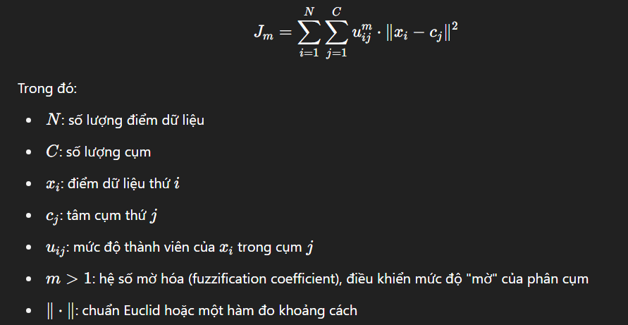

## Mục lục
1. Giới thiệu
- Tổng quan về phân cụm dữ liệu
- Khái niệm phân cụm mờ (fuzzy clustering)
- Ứng dụng của fuzzy clustering trong thế giới thực
2. Thuật toán Fuzzy C-Means
- Nguyên lý hoạt động
- Hàm mục tiêu và cập nhật tham số
- So sánh phân cụm mờ với phân cụm cứng
- Ưu điểm và nhược điểm của FCM
3. Cài đặt Fuzzy C-Means trong R
- Thư viện hỗ trợ (e1071, ppclust, cluster)
- Cấu trúc hàm cmeans()
- Ý nghĩa các tham số chính (centers, m, iter.max, membership, v.v.)
- Xử lý đầu vào: chuẩn hóa dữ liệu, chọn đặc trưng
4. Ứng dụng FCM trên bộ dữ liệu Netflix
- Giới thiệu dataset (nguồn gốc, các đặc trưng được chọn)
- Chuẩn bị và tiền xử lý dữ liệu
- Áp dụng FCM và giải thích kết quả
- Trực quan hóa các cụm và mức độ thành viên (fuzzy membership)
5. Phân tích kết quả
- Đặc điểm các cụm fuzzy (ví dụ: cụm phim hành động + hài)
- Hiện tượng "giao thoa cụm" và ý nghĩa thực tế
- Đánh giá chất lượng phân cụm (Silhouette, Xie-Beni index…)
6. Kết luận và hướng mở rộng
- Tóm tắt nội dung đã thực hiện
- Ưu điểm và hạn chế khi dùng FCM trên dữ liệu dạng này
- Gợi ý mở rộng: fuzzy cho phân loại cảm xúc phim, đề xuất nội dung...

## 1. Giới thiệu

### 1.1. Tổng quan về phân cụm dữ liệu

Phân cụm (clustering) là một kỹ thuật quan trọng trong khai phá dữ liệu (data mining) và học máy (machine learning), nhằm chia tập dữ liệu thành các nhóm (hoặc cụm) sao cho các điểm dữ liệu trong cùng một nhóm có tính chất tương đồng cao, trong khi khác biệt với các nhóm còn lại. Đây là một phương pháp học không giám sát (unsupervised learning), trong đó không yêu cầu nhãn trước cho các quan sát, mà thuật toán sẽ tự động phát hiện cấu trúc tiềm ẩn trong dữ liệu.

Khác với phân loại (classification), vốn dựa trên tập dữ liệu đã được gán nhãn để huấn luyện mô hình dự đoán nhãn cho dữ liệu mới, phân cụm tập trung vào việc xác định mối quan hệ nội tại giữa các điểm dữ liệu dựa trên các đặc trưng đầu vào. Việc phân cụm có thể phục vụ nhiều mục tiêu khác nhau như khám phá mẫu hình, nén dữ liệu, tiền xử lý cho các tác vụ học máy khác, hoặc hỗ trợ ra quyết định trong các lĩnh vực như marketing, y sinh, hệ thống đề xuất, và phân tích hành vi người dùng.

Phân cụm đóng vai trò đặc biệt trong bối cảnh dữ liệu lớn và đa chiều, nơi mà việc xác định thủ công các nhóm là bất khả thi. Sự xuất hiện của các phương pháp phân cụm linh hoạt như phân cụm mờ (fuzzy clustering) cho phép mô hình hóa tốt hơn các hiện tượng có tính chất chồng lấn hoặc không rạch ròi giữa các nhóm — điều thường xuyên xảy ra trong thế giới thực.

### 1.2. Khái niệm phân cụm mờ (fuzzy clustering)

Phân cụm mờ (fuzzy clustering), hay còn gọi là phân cụm mềm (soft clustering), là một mở rộng của phương pháp phân cụm truyền thống, cho phép mỗi điểm dữ liệu có thể thuộc về nhiều cụm cùng lúc với các mức độ thành viên (membership degree) khác nhau, thay vì chỉ gán tuyệt đối vào một cụm như trong phân cụm cứng (hard clustering). Điều này phản ánh tốt hơn bản chất không rạch ròi của nhiều hiện tượng trong thực tiễn, nơi mà ranh giới giữa các nhóm không luôn rõ ràng và dứt khoát.

Thay vì đưa ra một gán nhãn duy nhất cho mỗi điểm dữ liệu, phân cụm mờ gán cho mỗi điểm một vector các giá trị membership, thường có tổng bằng 1, thể hiện xác suất hay mức độ tương đối mà điểm đó thuộc về từng cụm. Nhờ đó, phương pháp này cung cấp cái nhìn linh hoạt và chi tiết hơn về cấu trúc dữ liệu, đặc biệt hữu ích trong các bài toán liên quan đến hành vi người dùng, cảm xúc, hoặc các thuộc tính có tính chất giao thoa.

Một trong những thuật toán phân cụm mờ phổ biến nhất hiện nay là Fuzzy C-Means (FCM), vốn kế thừa nhiều nguyên lý từ thuật toán K-Means nhưng bổ sung thêm cơ chế trọng số mềm để xác định mức độ thuộc về cụm. Việc sử dụng tham số mờ hóa (fuzzification coefficient) trong FCM giúp kiểm soát mức độ "mờ" trong quá trình phân cụm, từ đó cho phép điều chỉnh độ phân giải của các cụm theo mục tiêu ứng dụng.

Phân cụm mờ không chỉ hữu ích trong việc biểu diễn dữ liệu có cấu trúc chồng lấn mà còn là bước tiền xử lý hiệu quả cho các hệ thống đề xuất, phân tích thị trường và các mô hình suy luận mờ trong trí tuệ nhân tạo.

### 1.3. Ứng dụng của fuzzy clustering trong thế giới thực

Trong bối cảnh dữ liệu ngày càng phong phú và đa dạng, nhu cầu mô hình hóa những mối quan hệ phức tạp, không tuyến tính và không rõ ràng giữa các đối tượng trở nên cấp thiết. Phân cụm mờ (fuzzy clustering) nổi bật như một công cụ phù hợp để xử lý các tình huống mà ranh giới giữa các nhóm là mơ hồ hoặc không xác định dứt khoát. Phương pháp này đã chứng minh hiệu quả trong nhiều lĩnh vực thực tiễn.

Trong hệ thống đề xuất nội dung, chẳng hạn như gợi ý phim hoặc âm nhạc, một người dùng có thể đồng thời yêu thích nhiều thể loại khác nhau với các mức độ khác nhau. Việc áp dụng phân cụm mờ giúp xác định hồ sơ người dùng dưới dạng hỗn hợp nhiều cụm thị hiếu, từ đó cải thiện khả năng cá nhân hóa nội dung.

Trong lĩnh vực chẩn đoán y khoa, bệnh nhân có thể biểu hiện triệu chứng thuộc nhiều nhóm bệnh lý với mức độ khác nhau. Sử dụng phân cụm mờ cho phép hệ thống gợi ý nhiều khả năng thay vì chỉ kết luận duy nhất, phù hợp với thực tiễn chẩn đoán không chắc chắn và có tính chất phức hợp.

Trong nghiên cứu thị trường, người tiêu dùng thường không thuộc hoàn toàn vào một phân khúc cụ thể mà có thể mang đặc điểm của nhiều nhóm hành vi tiêu dùng. Phân cụm mờ cho phép doanh nghiệp hiểu rõ hơn về các nhóm khách hàng tiềm năng và đưa ra chiến lược tiếp cận linh hoạt hơn.

Ngoài ra, phân cụm mờ còn được ứng dụng trong các lĩnh vực như phân tích cảm xúc văn bản, nhận dạng mẫu trong thị giác máy tính, phân loại tài liệu, và phân tích dữ liệu không cấu trúc, nơi mà đặc trưng dữ liệu thường mang tính giao thoa hoặc không thuần nhất.

Sự linh hoạt trong biểu diễn và diễn giải kết quả của phương pháp phân cụm mờ, đặc biệt là với thuật toán Fuzzy C-Means, khiến nó trở thành lựa chọn hữu hiệu trong việc xử lý và khai thác thông tin từ dữ liệu thực tế có độ phức tạp cao.

## 2. Thuật toán Fuzzy C-Means

### 2.1. Nguyên lý hoạt động
Thuật toán Fuzzy C-Means (FCM) là một phương pháp phân cụm mờ được đề xuất bởi Dunn (1973) và sau đó được cải tiến bởi Bezdek (1981). Thuật toán cho phép mỗi điểm dữ liệu được gán một mức độ thành viên (membership degree) đối với từng cụm, thay vì một gán nhãn duy nhất như trong K-Means. Mức độ thành viên này phản ánh "độ phù hợp" của một điểm dữ liệu với từng cụm, và có giá trị trong khoảng [0,1], với tổng các giá trị thành viên của mỗi điểm bằng 1.

FCM tìm cách tối thiểu hóa hàm mục tiêu sau đây:

## References:
*Khái niệm*
1. Dunn, J. C. (1973-01-01). "A Fuzzy Relative of the ISODATA Process and Its Use in Detecting Compact Well-Separated Clusters". Journal of Cybernetics. 3 (3): 32–57. doi:10.1080/01969727308546046. ISSN 0022-0280.
2. Bezdek, James C. (1981). Pattern Recognition with Fuzzy Objective Function Algorithms. ISBN 0-306-40671-3.